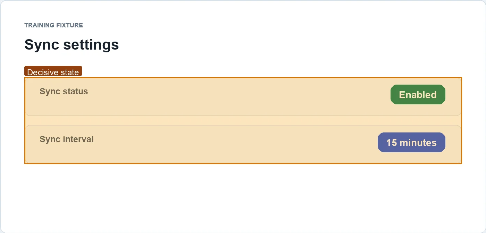

# 训练示例：同步间隔的证据型回复

## 结论

在这个**合成训练 fixture** 中，设置面板显示同步已启用，间隔为 15 分钟。该材料只演示如何组织视觉证据，不说明任何真实产品的行为或政策。

## 决定性证据

### C-1 · 合成页面显示启用状态和 15 分钟间隔

训练来源中的可见状态为 `Enabled` 和 `15 minutes`。见 [合成设置页面](https://example.invalid/visual-brief-fixtures/sync-settings)。

边界：这是离线教学 fixture；它不能证明真实账号、租户或产品存在相同设置。

## 下一步

真实项目应把本例的 fixture URL 换成 canonical source，并重新采集、脱敏和人工检查图片后再分享。

完整来源和可复现信息见 [evidence-index.md](evidence-index.md)。
