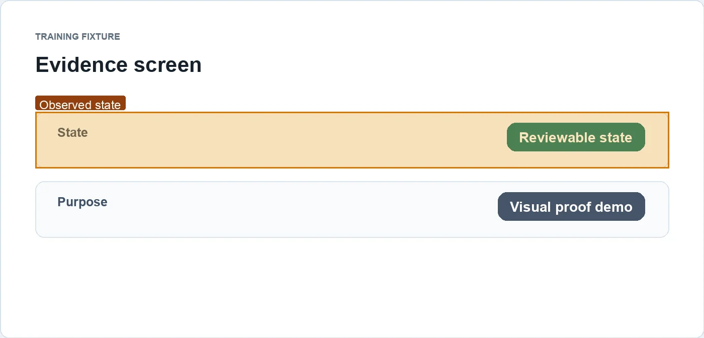
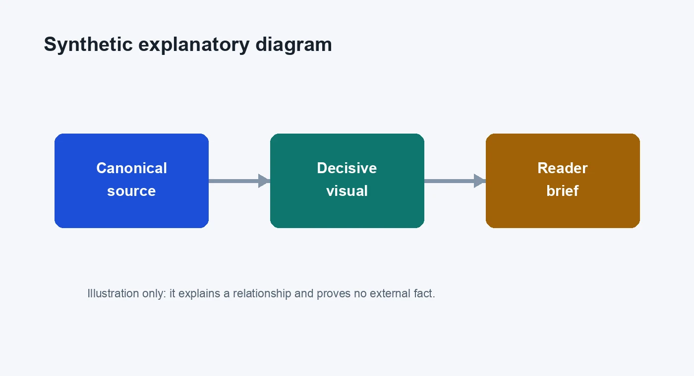

# 训练示例：把“证据”和“说明图”分层

## 核心观点

公共技术写作可以同时使用截图和生成图，但它们承担不同职责：截图让读者检查已观察到的状态，说明图帮助读者理解关系；说明图不能代替来源。

## 证据与解释

### C-1 · 合成来源页面显示一个可检查状态

合成来源页显示 `Reviewable state`，用来演示“截图靠近它所支持的文字”的阅读顺序。见 [合成来源页](https://example.invalid/visual-brief-fixtures/reviewable-state)。

边界：这只是教学 fixture，不说明任何真实系统。

### C-2 · 说明图展示两类素材的关系

下图是生成的教学图，不是来源截图，也没有证明任何事实。它用于说明证据、叙事和链接在同一个包中的关系。

图注：生成说明图；不构成事实证据。

## 限制与适用范围

该示例中的来源和图片均为合成材料。真实公开文章必须使用可访问的 canonical link、写明采集时间和边界，并复查图片许可与隐私。

## 来源

- [合成来源页](https://example.invalid/visual-brief-fixtures/reviewable-state)

渠道草稿仅保存在 [packages/social-drafts.md](packages/social-drafts.md)，未经明确批准不得发布。
