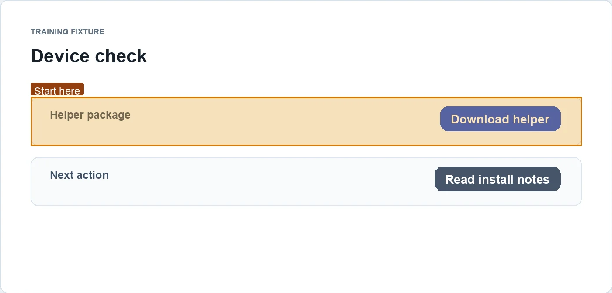
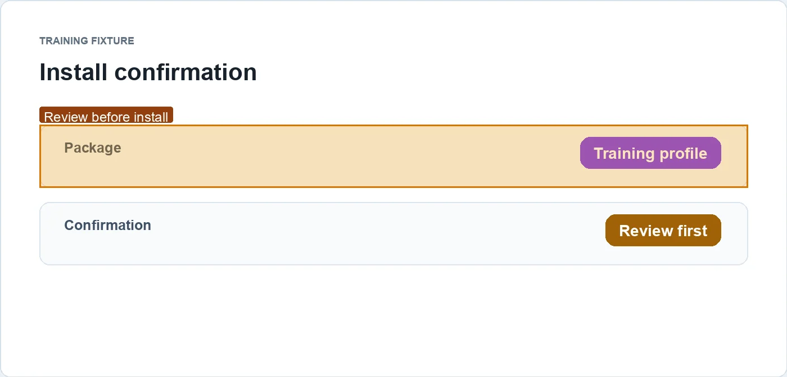
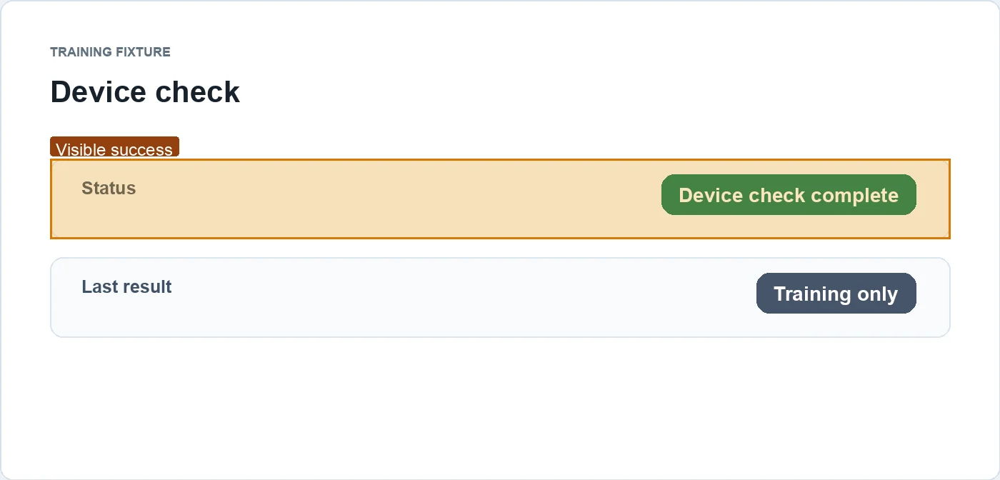

# 训练示例：完成设备检查

适用对象：有权访问**合成员工门户**的培训读者。

## 完成结果

最终页面显示 `Device check complete`。

## 步骤

### 1. 打开下载页

动作：在合成门户的 Device check 区域选择 `Download helper`。

预期状态：可以看到下载控件和下一步说明。

### 2. 查看安装前确认

动作：打开下载内容后，阅读安装前确认页。

预期状态：可以看到将要安装的 training profile 和继续按钮。

此处停止并确认后再继续：这是训练中的 profile 安装示意；真实流程应在安装或授予权限前等待组织批准。

### 3. 回到门户检查完成状态

动作：在合成门户中返回 Device check 状态页。

预期状态：显示 `Device check complete`。

## 成功检查

页面显示 `Device check complete`，而不是只看到下载按钮被点击。

## 遇到问题

这是离线训练材料。真实系统出现差异时，不要分享密码、验证码、cookie 或 token；向指定支持渠道提供经审阅的错误截图和环境信息。
